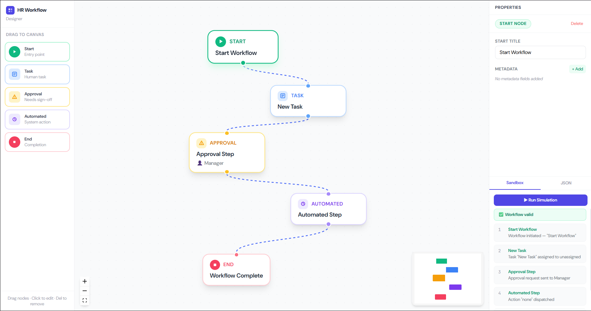
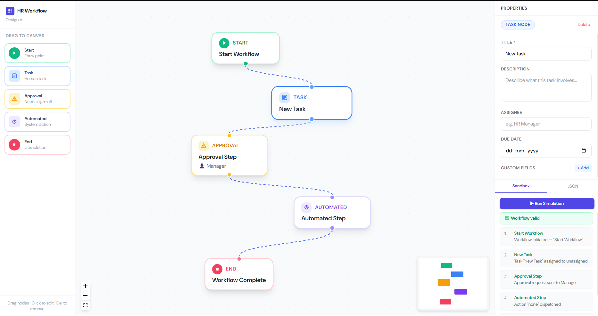
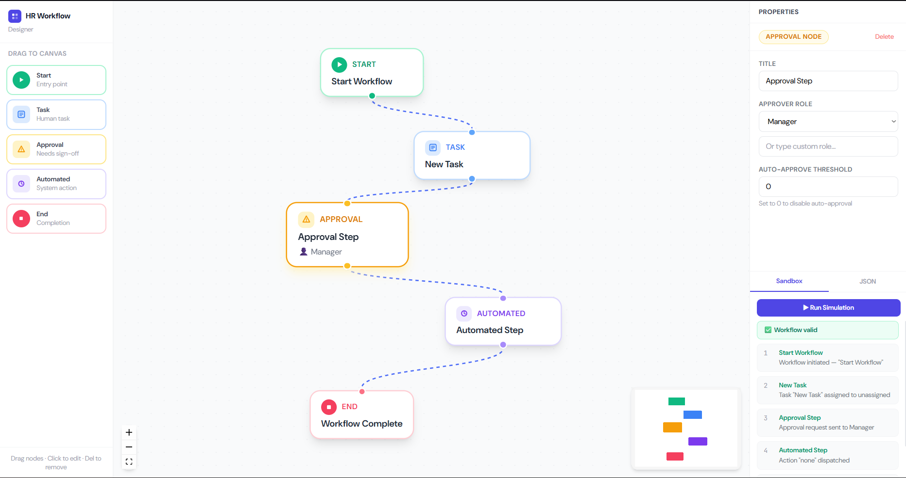
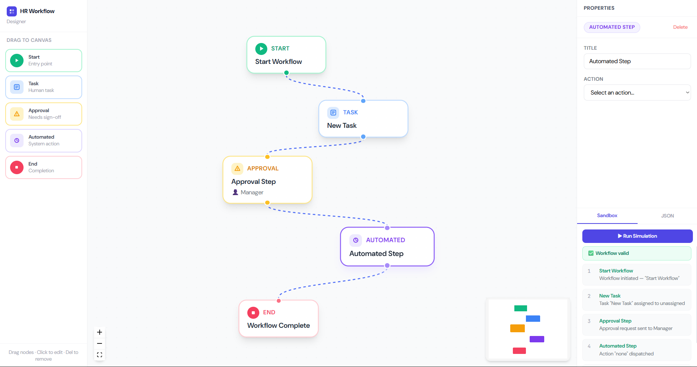
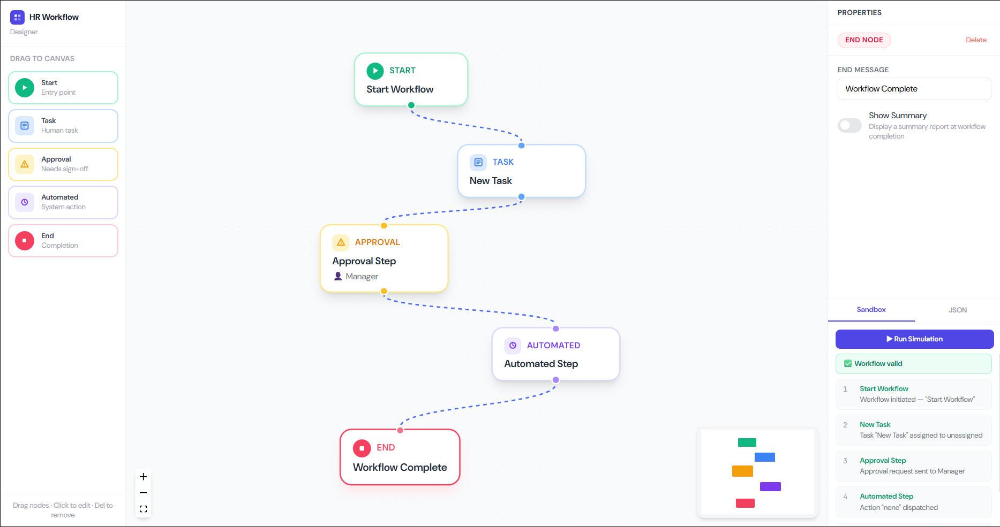

# HR Workflow 

## Screenshots

### Canvas Overview


### Node Types
| Start | Task | Approval | Automated | End |
|-------|------|----------|-----------|-----|
|  |  |  |  |  |

## Getting Started

```bash
npm install
npx msw init public/ --save
npm run dev
```

Open [http://localhost:5173](http://localhost:5173)

## Architecture

### Tech Stack
- **Vite + React 18 + TypeScript** — frontend framework
- **React Flow v11** — drag-and-drop canvas with custom nodes
- **Zustand** — global state (nodes, edges, selection)
- **MSW v2** — mock API layer (intercepts `/automations` and `/simulate`)
- **Tailwind CSS** — utility-first styling

### Folder Structure
```
src/
├── components/
│   ├── nodes/          # 5 custom React Flow node components
│   ├── forms/          # Per-node editing forms (controlled components)
│   └── panels/         # SidebarPanel, NodeFormPanel, SandboxPanel
├── hooks/
│   ├── useSimulate.ts  # POST /simulate abstraction
│   └── useAutomations.ts # GET /automations abstraction
├── mocks/
│   ├── handlers.ts     # MSW request handlers
│   └── browser.ts      # MSW service worker setup
├── store/
│   └── workflowStore.ts # Zustand store — single source of truth
└── types/
    └── workflow.ts      # All TypeScript interfaces
```

### Key Design Decisions

**State management**: Zustand was chosen over Context/Redux for its minimal boilerplate and direct store access outside React components. The entire graph state (nodes + edges + selection) lives in one store.

**Custom nodes**: Each node type has its own component with colour-coded visual identity (emerald=start, blue=task, amber=approval, violet=automated, rose=end). Nodes subscribe to the store only for `selectNode` — all data flows through React Flow's built-in `NodeProps`.

**Form abstraction**: Forms are pure controlled components — they receive `data` and `onChange`, with zero store dependency. This makes them individually testable and easy to extend for new node types.

**Mock API**: MSW intercepts at the network level, which means the `useSimulate` and `useAutomations` hooks use real `fetch()` calls — no special test-mode branching needed.

**Drag-and-drop**: Uses React Flow's `onDrop` + `project()` to convert screen coordinates to canvas coordinates. `getDefaultData()` returns sensible defaults for each node type on drop.

### Mock API Endpoints

**GET /automations**
Returns available automated actions with their parameter schemas.

**POST /simulate**
Accepts `{ nodes, edges }` and returns:
- `success: boolean`
- `steps[]` — per-node execution log
- `errors[]` — validation failures (missing start/end, disconnected nodes)

Validates: start node exists, end node exists, no disconnected nodes, no duplicate start nodes.

## Features Implemented
- [x] 5 custom node types with drag-and-drop from sidebar
- [x] Node editing forms with all required fields
- [x] Dynamic action params in Automated Step (loaded from mock API)
- [x] Key-value metadata/custom fields with add/remove
- [x] Mock API layer via MSW (GET /automations, POST /simulate)
- [x] Workflow sandbox — simulate + step-by-step execution log
- [x] Validation (missing start/end, disconnected nodes)
- [x] Export workflow as JSON download
- [x] Import workflow from JSON
- [x] MiniMap + Controls + dot grid background
- [x] Delete node via button or Delete key
- [x] Colour-coded node types

## What I Would Add With More Time
- Undo/redo (zustand-middleware or immer patches)
- Auto-layout using dagre
- Workflow validation errors shown visually on nodes
- Node templates (pre-built onboarding, leave approval flows)
- Cypress E2E tests for drag-drop and form interactions
- Backend persistence (PostgreSQL + FastAPI)
- Version history per node
